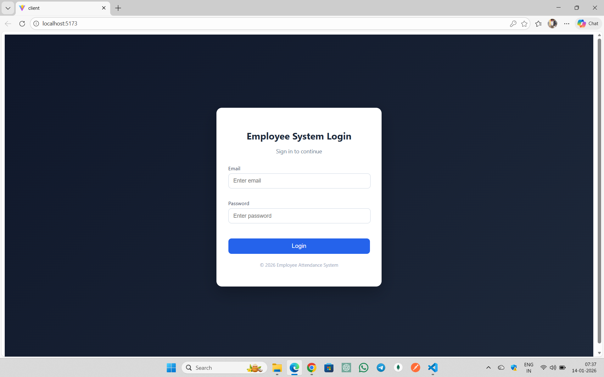
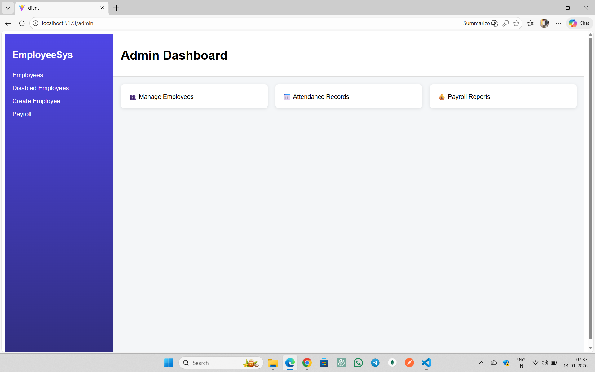
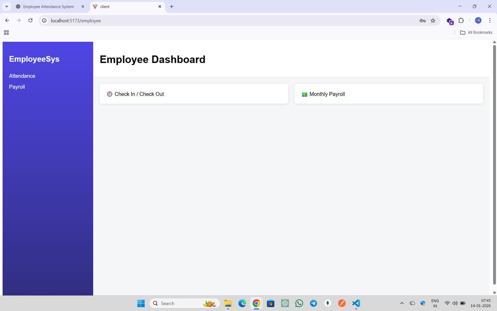
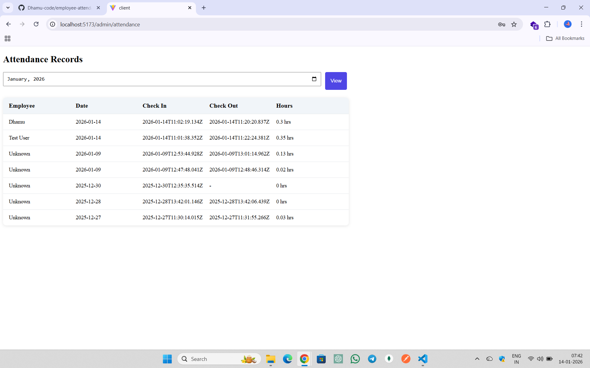
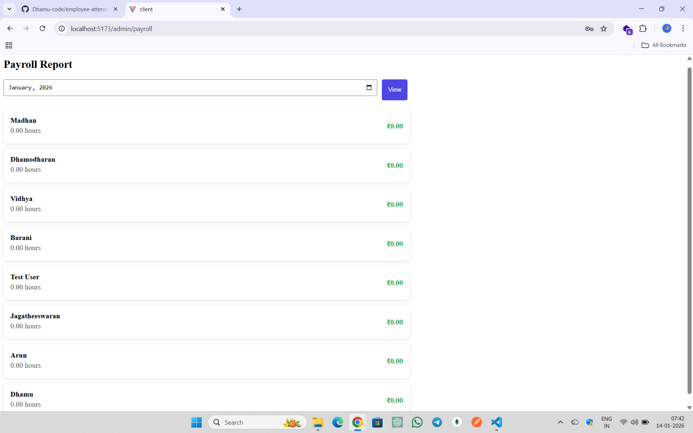

# 🧑‍💼 Employee Attendance & Payroll Management System (MERN)

A full-stack MERN application with **Admin and Employee dashboards** for managing attendance and payroll.

---

## 🚀 Features

### 👨‍💼 Admin Panel
- Admin login
- Create new employees
- Edit employee details
- Disable / Enable employees
- Reset employee passwords
- View all employees
- View monthly attendance reports
- View payroll report (salary calculated by hourly rate)

### 👨‍🔧 Employee Panel
- Employee login
- Daily Check-In and Check-Out
- View own attendance history
- View monthly payroll details

---

## 🛠 Tech Stack

| Frontend | Backend | Database |
|--------|--------|--------|
| React (Vite) | Node.js | MongoDB |
| CSS | Express.js | Mongoose |
| Axios | JWT Auth | |

---

## 🔐 Authentication

- JWT based authentication
- Role-based access (Admin / Employee)
- Protected routes on frontend and backend

---

## 📂 Project Structure

Employee-System
┣ client → React Frontend
┃ ┣ pages
┃ ┣ components
┃ ┗ services
┣ server → Express Backend
┃ ┣ controllers
┃ ┣ routes
┃ ┣ models
┃ ┗ middleware
┗ README.md

---

## ⚙️ Installation & Setup

### ✅ Prerequisites

- Node.js
- MongoDB (Atlas)
- Git

---

### 🔹 Backend Setup

```bash
cd server
npm install

```md
Create `.env` file:

MONGO_URI=...
JWT_SECRET=...
PORT=5000

Run backend:

npm run dev

### 🔹 Frontend Setup

cd client
npm install
npm run dev

---

## 📸 Screenshots

### 🔐 Login Page


### 👨‍💼 Admin Dashboard


### 👨‍🔧 Employee Dashboard


### 🕒 Attendance Page


### 💰 Payroll Page


## Author

Dhamodharan P
B.Sc Computer Science
MERN Full Stack Developer

---

## 🌐 Live Demo

🔗 Frontend: https://employee-attendancesystem.netlify.app/
🔗 Backend API: https://employee-attendance-system-wqyr.onrender.com

> ⚠️ Note: Admin login required to create employees.  
> Use employee credentials to test attendance and payroll features.

### 🔑 Demo Credentials

**Admin**
- Email: admin@test.com
- Password: 123456

**Employee**
- Email: test@test.com
- Password: 123456
